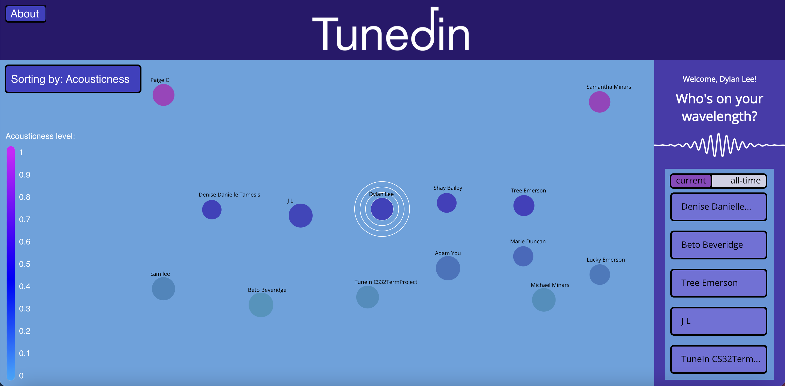
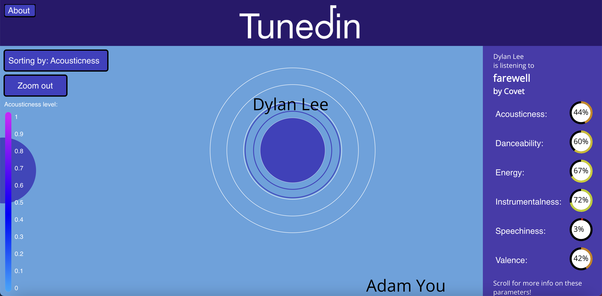

# README

Samantha Minars (sminars)\
Dylan Lee (dlee197)\
Dani Tamesis (dtamesis)\
Chance Emerson (cemerso3)

[Repository Link](https://github.com/cs0320-f2022/term-project-cemerso3-dlee197-dtamesis-sminars/)

<figure>

<figcaption text-align = "center"><b>Default view of our app post login.</b></figcaption>
</figure>

## What is TunedIn?

TunedIn provides a centralized application where users (specifically, college students in our first phase) automatically share the music that they are currently listening to on a given day, and are given the option to see other users that have similar music tastes to theirs as well as discover new music recommendations through peer users. 

The issue that our project attempts to solve is the lack of a good social-media-type application solely for sharing music. We don’t count TikTok, since TikTok is primarily for sharing original video content. Although Spotify has a built-in social display feature, most people use Spotify just for their own music enjoyment and exploration instead of as a medium to connect with other people. We know that this is something people could use because our peers expressed enthusiasm about the project when we’ve asked them about it and we also have all had experiences where music has connected us. This article in particular highlights the importance of music in forming social bonds with others. 

Because of the social-interaction focus of our project, our app may encourage people who do not typically listen to music to begin doing so in order to meet a greater community of people. Our project impacts people regardless of occupation, age, nationality, or racial group, but it definitely is biased towards people who can use the internet, as well as people who are not hearing impaired. In terms of accessibility, the app will likely be in English for the time being, but we may extend it to be more accessible to a wider range of languages in the future. Furthermore, at the beginning stages, this app will exclusively be accessible to college students at schools where we feel we can create enough buzz to start a user base.
Our app will allow anybody to view the most recent TunedIn of other users. Users can filter the display in terms of the following six parameters Spotify provides with each track:

<b>Acousticness</b> - A confidence measure from 0.0 to 1.0 of whether the track is acoustic. 1.0 represents high confidence the track is acoustic.

<b>Danceability</b>  - Danceability describes how suitable a track is for dancing based on a combination of musical elements including tempo, rhythm stability, beat strength, and overall regularity. A value of 0.0 is least danceable and 1.0 is most danceable.

<b>Energy</b>  - Energy is a measure from 0.0 to 1.0 and represents a perceptual measure of intensity and activity. Typically, energetic tracks feel fast, loud, and noisy. For example, death metal has high energy, while a Bach prelude scores low on the scale. Perceptual features contributing to this attribute include dynamic range, perceived loudness, timbre, onset rate, and general entropy.

<b>Instrumentalness</b>  - Predicts whether a track contains no vocals. "Ooh" and "aah" sounds are treated as instrumental in this context. Rap or spoken word tracks are clearly "vocal". The closer the instrumentalness value is to 1.0, the greater likelihood the track contains no vocal content. Values above 0.5 are intended to represent instrumental tracks, but confidence is higher as the value approaches 1.0.

<b>Speechiness</b>  - Speechiness detects the presence of spoken words in a track. The more exclusively speech-like the recording (e.g. talk show, audio book, poetry), the closer to 1.0 the attribute value. Values above 0.66 describe tracks that are probably made entirely of spoken words. Values between 0.33 and 0.66 describe tracks that may contain both music and speech, either in sections or layered, including such cases as rap music. Values below 0.33 most likely represent music and other non-speech-like tracks.

<b>Valence</b>  - A measure from 0.0 to 1.0 describing the musical positiveness conveyed by a track. Tracks with high valence sound more positive (e.g. happy, cheerful, euphoric), while tracks with low valence sound more negative (e.g. sad, depressed, angry).

Each user can view their daily connections and historical connections (other users will similar music taste) calculated via a 6-d tree algorithm using those six song metrics. Finally, our app will provide a beautiful data visualization for our users, displaying each user as a bubble in a vast floating landscape of other users, allowing the user to sort the bubbles (visual clustering) by any category they wish, as well as click on individual bubbles to view the users themselves and their most recent activity. Our project will also form an overall sense of community amongst users via this musical exchange, and hopefully help people discover others who either share their tastes, or enjoy something completely different.

## How-To Run TunedIn:

### Running the backend server:

Set the USING_MOCKS (boolean), FIRESTORE_PROJECT_ID (string), CLIENT_ID (string), and CLIENT_SECRET (string) environment variables in intelliJ. Setting USING_MOCKS to be "true" will display 100 mocked users on the frontend, while setting it to be false will only display real users of the app.
Run the server file (our preferred method is to run `Server.main()` in IntelliJ. Then, use a web browser to navigate to `localhost:3232` which is where the server is locally hosted. 

### Running the frontend web-app:

Navigate to the frontend directory. Ensure that all dependencies are installed by running `npm install`, followed by `npm install firebase`. Go into line 47 of App.tsx, located at frontend->src->App.tsx, and set the "usingmocks" local variable to match the value of USING_MOCKS in the intelliJ backend(aka false if false, true if true). Ensure that the backend is already running on `localhost:3232`. Then, run `npm start` to start the frontend server on `localhost:3000`.

## Design Choices:
### Frontend
- The frontend web app has three main components: the header, the sidebar, and the user bubble display.
  - Header: This bar runs across the top of the screen- it contains our tunedin app logo, the Google and Spotify Login buttons, and a small "about" button to the left that displays a popup window with information about the app and our team.
  - Sidebar: This bar has two display modes depending on whether or not you have selected a user onscreen.
    - If no user is selected on screen, the sidebar will display the current user's username, as well as the names of the top five users who match their music taste. A slider above the list of matches lets one toggle between viewing their top five current matches and the top five matches of all time. Scrolling down on the page displays a small blurb that explains the K-D tree algorithm that calculates these matches.
    - If a user is selected on screen, the sidebar will display that user's username, as well as the song and artist that they are listening to. Underneath this information lies a set of six dials, each of which displays the Acousticness, Energy, Danceability, Instrumentalness, Speechiness, and Valence values of the song the selected user is listening to. Each song value is displayed as a percentage, and the circular outlines around each value fill and color themselves accordingly. Redder colors correspond to a low percentage, while the color slowly progresses to orange, yellow, and then green for a full 100 percent. This circular dial design for the value displays adds to the visual engagement of our sidebar, and makes the data more legible from a distance.

<figure>

<figcaption text-align = "center"><b>Selecting a user's bubble onscreen to view their statistics.</b></figcaption>
</figure>

  - User bubble display: This section takes up the most space on our website; here, we fill a large window onscreen with a handful of colored bubbles, each bubble labeled with a username. For example, the current parameter we are sorting by is Acousticness, the user bubbles will distribute themselves vertically on the page based on the acousticness of the current song each user is listening to. User bubbles with higher acousticness will move higher on the screen, while user bubbles with lower acousticness will move towards the bottom. User bubbles will repel each other if they are too close, which prevents the bubbles from overlapping and becoming unreadable. The bubbles are also color coded by these parameter values: pinker bubbles correspond to higher values, while greener bubbles correspond to lower values. By clicking a button in the top left corner of the window, one can change the bubble sorting parameter, for example from from "Acousticness" to "Energy". One can also click on individual user bubbles to "zoom in" on a specific user and see what they are currently listening to.

The initial prototyping of the frontend was done in Desmos at the following link: https://www.desmos.com/calculator/a2uov4zzsd

### Firestore Database
- All users are stored as a document entry in a users collection stored on Firestore 
- When a user logins in with their Google information, a new user document is created in Firestore with the correct fields. 
- When a user links their Spotify account, a refresh token is generated for that user, and their document reference in Firestore is updated to contain the refresh token. 
- The Backend Server contains a FirestoreDatabase class that takes care of retrieving and updating user documents in Firestore. 

### Backend 
#### UserDatabase Interface
- This interface has three methods called within our various handlers: `getUser(userId)`, `updateUser(userId, user)`, and `getAllUserIds()`.
- We have two classes `LocalDatabase` and `FirestoreDatabase` that implement our `UserDatabase` interface.
- `LocalDatabase` contains an hashmap() of all users ids mapped to User objects. It's used to store mock users parsed from a CSV file. 
- `FirestoreDatabase` is wrapper class containing our initialization of the Firestore database. It takes care of all functionality related to reading data from and writing data to Firestore.
#### User & Song Classes
- `User` class represents an individual TuneIn user and houses essential user-specific information. It implements KdTreeNode so that users can be used to build the User-Tree. 
- `Song` class represents a specific song and stores related information (user id, title, song id, list of artists, array of audio features, k-d tree dimension). It implements KdTreeNode so that songs can be used to build the Song-Tree. 
#### K-D Tree Alogrithm 
- Tuned-In displays the top 5 connections for each user on a given day and also their top 5 all-time (historical) connections. 
- To find the top 5 connections for each user, we search for 5 nearest neighbors in a Song-Tree whose nodes are all the current songs identified to particular users via user ids (song point = 6 numerical audio features). 
- To find the 5 all-time connections for each user, we search 5 nearest neighbors in a User-Tree whose nodes are all the users (historical song point = aggregate average of each user's song point data). 
#### Server Class
- Our Server is set up with four handlers and their corresponding endpoints: load-song-features, load-connections, get-user, get-all-user-ids.
- The Server has an enviroment variable that controls whether we are using a local database with mock users or initializing the Firestore database to hold actual users (users who login on our frontend web-app).
- `LoadSongFeaturesHandler()` retrieves each user's most recently listened to song and then updates their user reference in the database. If we are using Firestore, we loop through every user retrieved from the database to make three calls are made to the Spotify API (exchanging refresh token for authentification token, retrieving most recently played track, retrieving audio features for that track). Then, we update each user in Firestore to reflect the song data retrieved via Spotify API calls. 
- `LoadConnectionsHandler()` builds a User-Tree and a Song-Tree from the database entries. The User-Tree is used to find each user's historical connections (based on aggregate song feature information). The Song-Tree is used to find each user's connections (based on six song features). After calculating each user's connections and historical connections, their refrenece in the database is updated. 
- `GetUserHandler()` generates a user object from its database reference. 
- `GetUserIdsHandler()` generates a list of all user ids from the database. 

## Errors/Bugs:

At this time, there are no known bugs with our program.

## Tests:

### Running tests:

For the backend, enter the backend folder and type `mvn test` in the terminal to run the tests.

For the frontend, enter the frontend folder and type `npm test` in the terminal to run the tests.

## External Resources:

k-D Tree:
- cs0320 kd-tree codebase package
- [cs0320 Spring 2022 k-D Tree Notes](https://hackmd.io/Hf6nxNbjQEWzG23KSGM2TA)
- [deleteNode for kD Tree](https://www.geeksforgeeks.org/k-dimensional-tree-set-3-delete/)

Spotify API:
- [Spotify Web API Documentation](https://developer.spotify.com/documentation/web-api/quick-start/)
- [Spotify API Java Wrapper library for making calls on backend with complicated authorization steps](https://github.com/spotify-web-api-java/spotify-web-api-java)
- [Spotify API Get Recently Played Docs](https://developer.spotify.com/documentation/web-api/reference/#/operations/get-recently-played)
- [Spotify Web API Authorization Guides and App Modes](https://developer.spotify.com/documentation/web-api/guides/development-extended-quota-modes/) (for client secret, client id, access tokens, etc. and developer app’s allowlist of 25 users)
- [Random Song search through Spotify API](https://perryjanssen.medium.com/getting-random-tracks-using-the-spotify-api-61889b0c0c27)
- https://stackoverflow.com/questions/39887342/how-can-i-get-an-access-token-spotify-api
- https://kaylouisebennett.medium.com/getting-started-with-spotifys-web-api-part-1-cff30c1b23ef
- https://dev.to/jpreagan/starting-a-personal-dashboard-with-the-spotify-api-526p
- https://medium.com/@davidjtomczyk/spotify-api-authorization-flow-with-react-and-rails-7f42845a43c
- https://www.newline.co/search?query=spotify+api&sortBy=positiveReviewCount%3AHighest+Rated%2CnumStudents%3AMost+Popular%2CcreatedAt%3AMost+Recent
- https://stackoverflow.com/questions/73737341/spotify-api-refresh-token-doesnt-return-a-token-with-refresh-token
- https://stackoverflow.com/questions/68155590/spotify-web-api-giving-me-illegal-scope-no-matter-what
- https://developer.spotify.com/documentation/web-api/guides/using-connect-web-api/
- https://react-hook-form.com/api/useform/setvalue/
- https://developer.spotify.com/documentation/general/guides/authorization/code-flow/
- https://khalilstemmler.com/articles/tutorials/getting-the-currently-playing-song-spotify/

Google Login:
- [Button CSS Styling](https://codepen.io/mupkoo/pen/YgddgB0)
- [Sign-In Functionality](https://firebase.google.com/docs/auth/web/google-signin)

Firestore: 
- [Initialzing Cloud Firestore](https://firebase.google.com/docs/firestore/quickstart#java_3)
- [Admin SDK](https://firebase.google.com/docs/admin/setup)
- [Reading Data](https://firebase.google.com/docs/firestore/query-data/get-data)
- [Writing Data](https://firebase.google.com/docs/firestore/manage-data/add-data)

HTML and CSS:
- [Make div scrollable](https://stackoverflow.com/questions/21227287/make-div-scrollable)
- [Make a promise from a group of promises](https://stackoverflow.com/questions/37841721/wait-for-multiple-promises-to-finish)
- [Formatting multiple scope values to oath](https://stackoverflow.com/questions/8449544/multiple-scope-values-to-oauth2)
- [Changing CSS variables with Javascript part 1](https://stackoverflow.com/questions/29564884/use-a-javascript-variable-in-css-to-control-the-visibility-of-the-object)
- [Changing CSS variables with Javascript part 2](https://www.w3schools.com/css/css3_variables_javascript.asp)
- [Using calc for CSS variables](https://stackoverflow.com/questions/53244501/css-calc-with-variables-and-multiplication)
- [Clickable buttons in svgs](https://stackoverflow.com/questions/39917883/button-element-inside-svg)
- [svg rectangles](https://www.w3schools.com/graphics/svg_rect.asp)
- [CSS transforms](https://www.w3schools.com/css/css3_2dtransforms.asp)
- [Collapseable sidebar with CSS and Javascript](https://www.w3schools.com/howto/howto_js_collapse_sidebar.asp)

Typescript and React:
- [Generating random strings in Javascript](https://stackoverflow.com/questions/1349404/generate-random-string-characters-in-javascript)
- [Integer rounding in Javascript](https://stackoverflow.com/questions/1684202/how-to-round-an-integer-up-or-down-to-the-nearest-10-using-javascript)
- [Building the game of life with React- used for fixing infinite loop bug](https://dev.to/toluagboola/build-the-game-of-life-with-react-and-typescript-5e0d)

## Contributors:

David Fryd (dfryd), for staying up with us until 3:00 AM debugging and locating a crucial missing step in our Spotify Authentication scheme, as well as for emotional support.

Galen Winsor (gwinsor), for providing constructive criticism on frontend design and general mentorship. 
